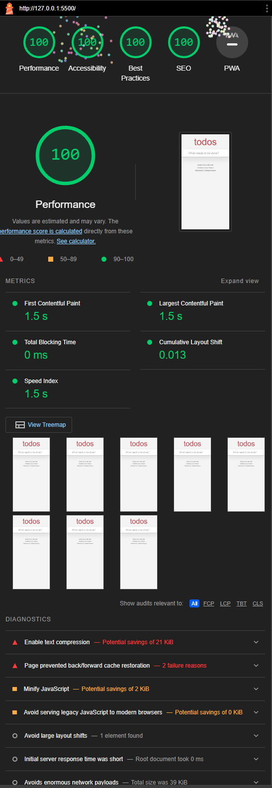

# Github Pages

Since we are now getting the styles via webpack, we can now see the page visually via github pages

To add a Github Page go to settings\

<figure><figcaption>
Github repo settings
</figcaption></figure>

Go to the page section, this can be found on the left side of the page

<figure><figcaption>
Pages section
</figcaption></figure>

Select the branch, and click save

<figure><figcaption>
select branch
</figcaption></figure>

Wait, you can now access the website via the link provided by github

<figure><figcaption>
Link to Github Pages
</figcaption></figure>
